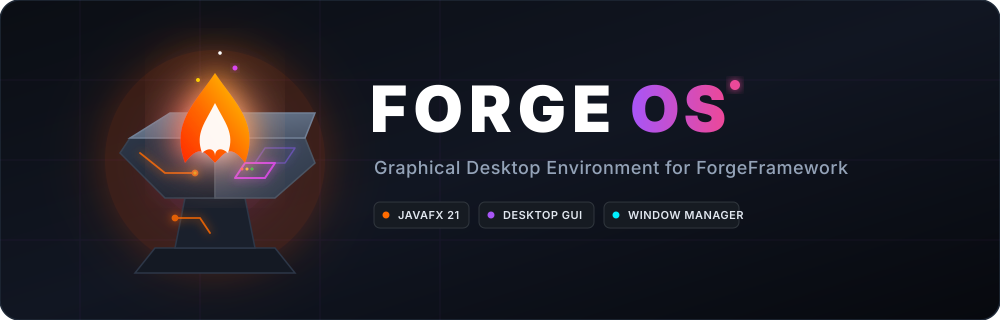

<div align="center">



[한국어](README.md) · **🇺🇸 English**

</div>

---

# ForgeOS

ForgeOS is a JavaFX desktop environment that runs on top of the
[ForgeFramework](https://github.com/Jongwoo0101/forge-framework) kernel. Watch processes move
through the scheduler in a table, read memory pressure off donut gauges, and see deadlocked
processes waiting on each other **as a picture** rather than a list of PIDs.

This repository contains neither kernel code nor command-parser code. Both arrive as Maven
artifacts, and the dependency is **one-way**: if ForgeOS disappeared, the kernel would not
notice.

```text
                       ForgeFramework          ← the kernel (separate repository)
                              ▲
                              │  requires
                ┌─────────────┼─────────────┐
                │             │             │
          ★ ForgeOS ★     ForgeCLI      ForgeStudio
                │             ▲
                └─────────────┘
                   requires — the Terminal app reuses the CLI's command layer
```

The Terminal app does not write its own parser; it reuses ForgeCLI's. Maintaining two parsers
guarantees that sooner or later a command works in the CLI but not in the GUI.

---

## Contents

- [Quick start](#quick-start)
- [The cinematic boot](#the-cinematic-boot)
- [Using the desktop](#using-the-desktop)
  - [Menu bar](#menu-bar)
  - [Dock](#dock)
  - [Windows](#windows)
  - [Keyboard shortcuts](#keyboard-shortcuts)
- [Built-in apps](#built-in-apps)
  - [Terminal](#terminal)
  - [Activity Monitor](#activity-monitor)
  - [Finder](#finder)
  - [Notepad](#notepad)
  - [Firefox](#firefox)
  - [Deadlock Resolver](#deadlock-resolver)
- [Theme and wallpaper](#theme-and-wallpaper)
- [Learn by scenario](#learn-by-scenario)
- [Project layout](#project-layout)
- [License](#license)

---

## Quick start

### Download instead of building

Platform installers are attached to each
[GitHub release](https://github.com/Jongwoo0101/forge-os/releases). **You do not need Java
installed** — the runtime ships inside (a jlink image).

| File | For |
|---|---|
| `ForgeOS-*-macos-arm64.dmg` | Apple Silicon Mac |
| `ForgeOS-*-macos-x64.dmg` | Intel Mac |
| `ForgeOS-*-windows-x64.msi` | Windows 10 · 11 |
| `ForgeOS-*-linux-x64.deb` | Debian · Ubuntu |
| `ForgeOS-*-portable.zip` | Unzip and run `bin/ForgeOS`, no installer |

> **macOS note — this app is not signed or notarised.**
> If macOS says it "is damaged and can't be opened", run this once:
> ```bash
> xattr -dr com.apple.quarantine /Applications/ForgeOS.app
> ```
> That is Apple attaching a quarantine attribute to unsigned apps; the app is not actually
> damaged. This is a personal project without an Apple Developer account ($99/year).

The rest of this section is for **building from source**.

### Requirements

- **JDK 21** or newer
- ForgeFramework kernel `1.1.0` installed in your local Maven repository (`~/.m2`)
- ForgeCLI `1.1.0` installed in your local Maven repository

> **From `1.1.0` the three repositories share one version number**, so you never have to
> look up which CLI matches which kernel. A `1.0` kernel will not build this release —
> ForgeOS now reads the `fork` · swap · `disk.img` fields on the kernel's DTOs directly.

You do not install JavaFX separately. The Gradle plugin (`org.openjfx.javafxplugin`) fetches
the runtime for your platform (mac-aarch64 · win · linux) automatically.

### 1. Install the kernel first

```bash
git clone https://github.com/Jongwoo0101/forge-framework.git
cd forge-framework
./gradlew publishToMavenLocal      # or ./scripts/publish.sh
```

### 2. Install the command layer (ForgeCLI)

```bash
git clone https://github.com/Jongwoo0101/forge-cli.git
cd forge-cli
./gradlew publishToMavenLocal
```

This installs `io.github.jongwoo0101:forgeframework:1.1.0` and
`io.github.jongwoo0101:forgecli:1.1.0` into `~/.m2/repository`.

### 3. Run ForgeOS

```bash
git clone https://github.com/Jongwoo0101/forge-os.git
cd forge-os

./scripts/run.sh                   # or ./gradlew run
```

> If dependency resolution fails, you almost certainly skipped a `publishToMavenLocal` in
> step 1 or 2. Both artifacts must be `1.1.0`. ForgeCLI first exported
> its command layer for other clients to use.

### Artifacts

| Command | Description |
|---|---|
| `./gradlew run` | Launch during development. Fastest path. |
| `./gradlew build` | Compile and verify. Zero warnings (`-Xlint:all -Werror`) is the baseline. |
| `./scripts/package.sh` | Installer and portable image **for the current platform** (`jpackage` + `jlinkZip`) |

A JavaFX application needs a platform-specific runtime on the module path, so unlike ForgeCLI
this project does not ship a single `java -jar` runnable jar. Instead **jlink** builds a
runtime image carrying only the JDK modules it needs, and **jpackage** bakes that into an
installer.

jlink images **do not cross-compile**: run it on macOS and you get a `.dmg`, on Windows an
`.msi`. All four targets are built together by `.github/workflows/release.yml` — push a `v*`
tag and four runners (mac arm64 · mac x64 · win · linux) each bake one and attach it to a
release, with the body filled from `docs/RELEASE_NOTES_*.md`.

> `javafx.web` (WebKit) makes the artifacts roughly **300 MB**. That is the price of shipping
> a browser.

---

## The cinematic boot

Launching does not drop you straight onto a desktop. Three stages run first.

### Stage 1 — terminal boot log

Kernel log lines are typed out one character at a time on a black screen. **This is not
staged text — it is the real kernel log.** The kernel boots on a background thread and every
line `EventLogger` emits is piped straight to the screen.

```text
=================================================
 ForgeFramework v1.1.0
 Operating System Kernel Architecture Engine
=================================================
[10:32:11.153] [INFO] Hardware check...
[10:32:11.306] [INFO] Initialising event logger...
[10:32:11.457] [INFO] Initialising kernel...
[10:32:11.607] [INFO] Initialising subsystems...
[10:32:11.612] [INFO] ProcessManager initialized [Scheduler: Round Robin (RR), timeQuantum: 3]
...
```

### Stage 2 — MP4 boot animation

The text fades out and `src/main/resources/assets/forgeOS-Booting-Animation2.mp4` plays
full-screen through a `MediaView`.

### Stage 3 — desktop

When playback ends (`setOnEndOfMedia`) the screen cross-fades into the desktop: wallpaper,
top menu bar, bottom Dock.

> **Stages are joined by events, not by time.** Stitching them together with fixed durations
> is guaranteed to drift — kernel boot time varies by machine and typing time varies with log
> length. Stage 1 → 2 fires when *the kernel has booted **and** the typing queue has drained*;
> stage 2 → 3 fires on the *end-of-media event*.

`ESC`, `Space` or a click skips the presentation. Kernel boot itself cannot be skipped, so
pressing early simply jumps to the desktop the moment boot completes.

---

## Using the desktop

### Menu bar

The translucent bar across the top. The left side answers "what am I using", the right side
answers "what is the kernel doing".

| Side | Contents |
|---|---|
| Left | Forge mark · active window title · `창` (Window) menu |
| Right | Process count · memory usage · uptime · theme toggle · clock |

The three chips on the right refresh every second via `PS`, `MEMINFO` and `UPTIME` system
calls. Keeping kernel state visible in one line no matter which app you are in is the point
of this simulator, so it gets permanent real estate.

### Dock

A glass bar at the bottom centre. Hovering an icon shows the **app name directly above it,
centred**. Icon sizes never change.

- Click an icon to launch. If the app is already open, its window comes forward.
- Click the active window's icon again to minimise it.
- Running apps get a cyan border and a dot underneath.

This started out as macOS-style magnification, but no falloff curve removed the sense that
**neighbouring icons rise along with the one you are aiming at**. In a dock of a handful of
widely-spaced icons, magnification does not help you aim — it blurs the answer to "what am I
pointing at". So nothing resizes; only the name appears. It answers the actual question and
leaves the screen still.

The name is a label inside the Dock, not a `Tooltip`. JavaFX tooltips follow the pointer and
appear below and to the right, which — at the very bottom of the screen — either covers the
icon or falls off the display.

### Windows

Instead of spawning multiple JavaFX `Stage`s, windows are **nodes** on the desktop (a custom
MDI). That is what lets them stay inside the desktop area, get sucked into the Dock, and
layer over translucent material.

| Action | How |
|---|---|
| Move | Drag the title bar. The grab point is preserved; dragging past the edge rubber-bands and springs back. |
| Resize | Drag any of the eight window edges |
| Full screen | Green button, or double-click the title bar |
| Minimise | Yellow button → flies into the Dock. Click the Dock icon to restore. |
| Close | Red button |
| Bring to front | Click anywhere in the window |

The traffic lights follow macOS placement and behaviour but use the Forge palette —
🔴 Forge Ember · 🟡 Molten Gold · 🟢 Electric Cyan. The glyphs appear on all three at once
when the pointer enters any of them.

### Keyboard shortcuts

| Key | Action |
|---|---|
| `Cmd/Ctrl + W` | Close the active window |
| `Cmd/Ctrl + M` | Minimise the active window |
| `Cmd/Ctrl + Shift + L` | Toggle light / dark theme |
| `ESC` · `Space` · click | Skip the boot presentation |

---

## Built-in apps

### Apps are kernel processes

Opening a window **creates a process and allocates memory** in the kernel. Keep Activity
Monitor open, launch Firefox, and a `firefox` row appears while the heap gauge moves. Close
the window and the process is killed, its address space reclaimed.

Firefox takes 8 bytes (two frames); the other five take 4 each. The numbers are that small
because the default kernel has **64 bytes of physical memory** — sixteen 4-byte frames. The
browser being the heaviest app is not a joke: every other app just renders kernel tables,
while this one carries a WebKit engine.

**App processes do not compete for the CPU.** Each is parked in `WAITING` on the keyboard
queue (`io_req … keyboard`) the moment it is created. Kernel processes are all "batch jobs
that use their burst time and finish", which a GUI app is not — and more practically, an
unparked, never-ending process would let **the first app opened hold the CPU forever under
FCFS**, so nothing the user spawns would ever run. Type `type hello` in the Terminal and one
app process briefly wakes to `READY`, then is parked again on the next refresh — which is what
a GUI app actually does after handling input.

> Force-killing an app process from Activity Monitor **closes that app's window.** For the
> table and the screen to mean the same thing it has to work in both directions; one
> direction only makes the table decorative.

Five of the six bind the kernel's **immutable record DTOs directly** to tables and shapes rather
than turning them into strings first. If the GUI re-parsed text that the CLI had formatted,
every formatting change would break the screen.

### Terminal

Runs all **42 ForgeCLI commands** unchanged — including the nine added in `1.1.0`
(`fork` · `priority` · `mem_read` · `mem_write` · `pagetable` · `swapinfo` · `sync` ·
`type` · `diskfinish`), which arrived **without a single line of ForgeOS code changing**:
commands register with `StandardCommands`, and the Terminal takes that list as-is.
The same input produces exactly the same result
as the CLI, because it is the same `CommandRegistry`.

| Feature | How |
|---|---|
| Run a command | Type and press `Enter` |
| Previous command | `↑` · `↓` |
| Command completion | `Tab` (prints candidates when ambiguous) |
| Clear the screen | `clear` or `Cmd/Ctrl + L` |

```text
forgeframework:/> exec worker 20
forgeframework:/> ps
PID   | STATE      | CPU_TIME | BURST      | NAME
-------------------------------------------------------
1     | RUNNING    | 3        | 20         | worker
```

Failed commands render in Ember, prompts in Cyan. Typing `shutdown` brings the kernel down
and covers the whole desktop with a shutdown screen.

> The Terminal stays dark even in the light theme. A white shell makes fixed-width output
> read like a document, and it severs the sense that this is the same thing as the boot
> console.

### Activity Monitor

Processes and memory, refreshed once per second. In `1.1.0` the kernel gained six schedulers,
swap and `fork`, which split the question this app answers in two — so it now has two tabs.

**Processes tab** — *why was that process picked?*

| Area | Contents | System calls |
|---|---|---|
| Table | PID · name · **PPID** · **priority** · **queue level** · state badge · CPU usage · progress bar | `PS` |
| Toolbar | Spawn (name · burst · **priority**) · **fork** · force-kill · **pick one of six schedulers** | `EXEC` `FORK` `KILL` `SCHEDULER` |
| Row context menu | Fork · raise/lower priority · force-kill | `FORK` `PRIORITY` `KILL` |
| Bottom strip | Ready queues. Under MLFQ, `Q0` `Q1` `Q2` each show their own quantum | `SCHEDULER` |

Select a process, press **fork**, and the status line reports how many pages the child shares
copy-on-write — while the physical-frame gauge stays exactly where it was.

**Memory tab** — *where did the memory go?*

| Table | Contents | System calls |
|---|---|---|
| Frame table | Frame · USED/FREE · owner PID · page · **REF** · **flags (D · R · COW)** | `FRAMETABLE` |
| Page table | Page · **MEM/SWAP** · frame · **swap slot** · permission · **COW** · REF | `PAGETABLE` |

The page table follows whichever process is selected in the Processes tab. Side by side, the
two tables make it obvious that right after a `fork` parent and child point at the **same
frame number** while that frame's REF count reads 2.

**Sidebar (shared by both tabs)** — four gauges and the replacement policy

| Gauge | What it measures | Colour |
|---|---|---|
| Physical frames | Trouble when exhausted | Ember |
| Heap usage | A caution signal | Gold |
| TLB hit ratio | A value you want high | Cyan |
| **Swap slots** | A different kind of event — pushed out to disk | Violet |

Below them sit the **page replacement policy** picker (`FIFO` · `LRU` · `CLOCK`) and the fault
counters (page faults · swap-ins · swap-outs · COW faults). On a kernel with swap disabled
(`swapSlots = 0`) the gauge simply reads "swap is off".

State badges are colour-coded by meaning — `RUNNING`/`READY` in Cyan, `WAITING` in Gold,
`TERMINATED` in Ember. You see the state before you read the word.

> The table is replaced wholesale every second but **the selection survives**. A table that
> drops your selection while you reach for the kill button is unusable.

> The scheduler and policy pickers mirror kernel state *and* accept input. Setting a value
> fires a change event even when it is only a mirror, so left alone they would send "change
> to the current value" to the kernel once a second. The `syncing` flag breaks that loop.

### Finder

Browses the file system in a macOS multi-column view. Columns beat a tree view here because
this file system is inode-based: a column view shows both "which directory am I in" and
"what else lives beside this entry" at the same time.

| Action | Result | System calls |
|---|---|---|
| Select a directory | A new column appears to the right | `LS` |
| Select a file | A content preview appears to the right | `CAT` |
| New folder · new file | Created inside the current column | `MKDIR` `TOUCH` |
| **Write to disk** | Flushes the file system to `disk.img` | `SYNC` |

If the kernel was started without a disk image, the toolbar says so rather than reporting an
error — having no image is the default, not a failure.

### Notepad

A text editor that lives on the **kernel's** file system rather than the host's. That is the
whole point: a file saved here shows up in Finder's columns immediately, reads back through
`cat` in the Terminal, and lands in `disk.img` on the next `sync`.

| Action | Result | System calls |
|---|---|---|
| Pick a file in the sidebar | Loads it into the editor | `CAT` |
| Pick a folder · go up | Navigates the listing | `LS` |
| Type a name and press **create** | Creates an empty file and opens it | `TOUCH` |
| **Save** (`Cmd/Ctrl + S`) | Overwrites the file wholesale | `WRITE` |
| **Revert** | Reloads what is on disk | `CAT` |
| **Write to disk** | Flushes to `disk.img` | `SYNC` |

**There is not a single dialog in this app.** "Enter a name" or "save before closing?" as a
`Dialog` opens a real native window each time, and ForgeOS is built on the premise that
everything inside the desktop is a node. So new file names come from a toolbar field, and
unsaved work is kept as a **draft** instead of being asked about — move between files freely,
your edits stay, and a dot (•) in the list marks what has not been saved yet. The question
was removed rather than answered.

### Firefox

The default web browser, and the only app that never calls the kernel.

| Feature | How |
|---|---|
| Navigate | Type a URL or a search term. `://` is taken literally, a dotted token gets `https://`, anything else is a search |
| Back · forward | Toolbar arrows, enabled from `WebHistory` |
| Reload · stop | One button; it becomes stop while loading |
| Home | The built-in start page (`forge://start`) |
| Tabs | `+` adds one. `target="_blank"` and `window.open` open tabs, not windows |

**An honest note about the engine.** This app does not embed Mozilla's Gecko. The only
rendering engine JavaFX ships is **WebKit**, in `javafx.web`, and there is no way to host
Gecko inside a Java process. So this is "a browser running inside a ForgeOS window", and the
name and the role of default browser were given to Firefox. Launching the host's real Firefox
was the alternative, but then the window escapes ForgeOS and the virtual desktop stops being
one.

The start page is a built-in document rather than a remote address for the same kind of
reason: point home at a live site and the first thing a user sees on a machine without a
network is an error page, which is indistinguishable from a broken app.

> `javafx.web` is the one module with a different weight class — it drags the whole WebKit
> native library along and adds close to 100 MB to a distribution. It is in anyway, because
> without a browser this is hard to call a desktop environment.

### Deadlock Resolver

The left half is **numbers** (Allocation · Max · Need); the right half is **relationships**
(who waits on whom). Banker's is a matrix algorithm and deadlock detection is a graph
algorithm, so putting them side by side shows the same situation two ways at once.

| Area | Contents | System calls |
|---|---|---|
| Toolbar | Banker's toggle · victim policy · detect · recover | `BANKER` `DETECT` `RECOVER` |
| Left table | Available/total vectors plus per-process Allocation · Max · Need · pending request | `RES_INFO` |
| Right | Wait-for graph — processes on a circle, wait edges as arrows | `DETECT` |
| Bottom | Enter a PID and a vector to declare max, request, or release | `RES_MAX` `RES_REQ` `RES_FREE` |

Only the deadlocked nodes turn Ember, with a halo that slowly pulses. Every other node stays
neutral, so your eye goes straight there — no hunting for the cycle in a table.

> The toggle switch only **reflects the kernel's value**. Type `banker off` in the Terminal
> and the switch follows. A switch that owns its own state drifts out of sync with the kernel.

---

## Theme and wallpaper

Toggle light ↔ dark with the sun/moon icon on the right of the menu bar, or
`Cmd/Ctrl + Shift + L`. The icon shows **where pressing it takes you**, not the current state.

Switching replaces the **token stylesheet wholesale** rather than adding a class to the root.
Context menus, tooltips and combo popups each own their own `Scene`, so a root class never
reaches them — but they do inherit the owning scene's stylesheets.

```text
tokens-dark.css / tokens-light.css   colours only; the token name sets must match exactly
theme.css / apps.css                 structure and dimensions; no literal colours allowed
```

Three places deliberately ignore the theme: the **boot screen** (a machine's console has no
light mode), the **Terminal**, and the **logo mark** (a brand is the same object in both
themes).

The wallpaper is not an image file but a vector rebuilt from the paths in
`assets/forgeOS-logo.svg` (`ui/ForgeMark`). JavaFX cannot read SVG files, and baking a PNG
would smear at wallpaper size and could not follow the theme. It scales with the screen's
shorter side and sits **dead centre**. Being covered by windows is a wallpaper's normal
condition; what matters more is that the screen has an axis when nothing is open.

---

## Learn by scenario

### Scenario 1 — watch the scheduler turn processes over

1. Open **Activity Monitor** from the Dock.
2. Enter a name and burst time in the toolbar and press `실행` a few times to spawn 3–4
   processes.
3. Sit still. A timer interrupt fires once per second; state badges flip between `READY` and
   `RUNNING` and the progress bars fill.
4. Switch the **scheduler** picker to `SJF`. Preemption is gone and the shortest job runs first.
5. Switch to `MLFQ`. The strip below the table splits into `Q0` `Q1` `Q2`, each with its own
   quantum (doubling as you go down), and processes that burn a quantum drop a level.
6. Switch to `Priority` and nudge priorities from the row context menu. Lower values run
   first (same direction as Unix nice), and high values keep getting pushed back — **starvation
   is not a defect here, it is the thing to observe**, and seeing it is what makes MLFQ's
   periodic boost explicable.

### Scenario 2 — watch `fork` add no frames at all

1. Open **Activity Monitor** and spawn one process.
2. In the Terminal run `malloc 1 8` and `mem_write 1 0 65`.
3. Back in Activity Monitor, select it and press **fork**. The status line reports the shared
   COW pages, and **the physical-frame gauge does not move**.
4. Open the **Memory tab**. The frame table shows REF `2` with a `COW` flag, and both page
   tables point at the **same frame number**.
5. Run `mem_write 2 0 99` and look again. **Exactly one page** split off into a new frame, and
   `mem_read 1 0` still returns `65`.

### Scenario 3 — cause a page fault on purpose

Swap is invisible while frames are plentiful, so ask for a heap larger than physical memory.

```text
exec big 40
malloc 1 64            ← with frames short, the kernel pushes pages out to swap
pagetable 1            ← some pages now read SWAP
mem_read 1 0           ← PAGE FAULT — fetched back from swap
```

The Memory tab shows `MEM` and `SWAP` mixed in one page table while the sidebar counters
climb. Switch the **page replacement policy** from `LRU` to `CLOCK` and repeat: a different
frame gets evicted.

### Scenario 4 — watch a file survive a reboot

1. Open **Notepad**, create a file, type something, **save**.
2. Open **Finder** — it is in the column, and selecting it shows the content.
3. Run `cat <name>` in the Terminal. Same content: three apps looking at one inode.
4. Press **write to disk**. The toolbar reports how many bytes went into `disk.img`.
5. Restart ForgeOS and open Finder: the file is still there (when the kernel was started with
   a disk image).

### Scenario 5 — build a deadlock and see the cycle

Open **Deadlock Resolver** and switch Banker's algorithm **off** (a deadlock cannot form
while avoidance is on). In the Terminal, spawn two processes and request resources in this
order:

```text
exec p1 30
exec p2 30
res_req 1 6 0 0
res_req 2 4 4 0
res_req 1 4 0 0        ← blocks
res_req 2 0 2 0        ← blocks → circular wait complete
```

Back in Deadlock Resolver both nodes are Ember and their arrows form a loop. Press `복구`
(Recover) and a victim is terminated, breaking the cycle.

### Scenario 6 — the moment avoidance blocks a request

Same app, this time with the toggle **on**:

```text
exec p1 30
exec p2 30
res_max 1 7 5 3
res_max 2 3 2 2
res_req 1 7 4 3        ← GRANTED
res_req 2 3 2 2        ← BLOCKED_UNSAFE: resources remain, but granting them is unsafe
```

The Available vector still shows headroom, yet the request is refused. That is avoidance
earning its keep. Turn the toggle off, repeat the request, and it succeeds — after which the
deadlock from scenario 2 becomes possible.

### Scenario 7 — watch the TLB hit ratio climb

Leave **Activity Monitor** open and run this in the Terminal:

```text
exec app 20
malloc 1 8
translate 1 0          ← MISS
translate 1 0          ← HIT
translate 1 0
```

The TLB donut fills. Since the TLB holds only 4 entries, sweeping five or more distinct pages
drops the ratio again — replacement, visible.

### Scenario 8 — kill an app's process

1. Open **Activity Monitor**. Its own `activity-monitor` process is already in the table,
   sitting in `WAITING`.
2. Open **Firefox**. A `firefox` row appears and the heap gauge visibly moves.
3. Run `type hello` in the Terminal — one app process flips to `READY` and is parked again
   on the next refresh.
4. Select the `firefox` row and press **force-kill**. **The Firefox window closes.**
5. The physical-frame gauge drops: killing a process makes the kernel reclaim its whole
   address space.

---

## Project layout

```text
forge-os/
├── .github/workflows/release.yml        # v* tag → four runners bake installers onto a release
├── assets/                              # logo and banner SVGs (README and releases)
│   └── icons/                           # jpackage icons (.icns · .ico · .png)
├── build.gradle.kts                     # kernel + CLI as Maven artifacts, JavaFX plugin
├── settings.gradle.kts
├── gradle.properties                    # forgeFrameworkVersion · forgeCliVersion · javafxVersion
├── docs/
│   ├── COMMIT_PLAN_1.0.md · RELEASE_NOTES_1.0.md
│   ├── COMMIT_PLAN_1.1.0.md
│   └── RELEASE_NOTES_1.1.0.md
├── scripts/
│   ├── build.sh
│   ├── run.sh
│   └── package.sh                       # installer for this platform (jpackage + jlinkZip)
└── src/main/
    ├── java/
    │   ├── module-info.java             # requires forgeframework, forgeframework.cli, javafx.* (incl. web)
    │   └── forgeos/
    │       ├── Launcher.java            # entry point — one layer so a missing JavaFX runtime is diagnosable
    │       ├── ForgeOsApp.java          # makes one window and runs the boot sequence. That is all
    │       ├── core/
    │       │   └── KernelService.java   # the only channel between kernel and UI (thread boundary, refresh pulse)
    │       ├── boot/
    │       │   ├── BootSequence.java    # three-stage orchestration
    │       │   ├── BootConsole.java     # typewriter (arrival and output separated by a queue)
    │       │   └── BootVideo.java       # MediaView (handles media-inside-jar)
    │       ├── desktop/
    │       │   ├── DesktopPane.java     # layer order and work-area computation
    │       │   ├── Wallpaper.java       # logo wallpaper
    │       │   ├── MenuBarView.java     # top menu bar
    │       │   └── DockView.java        # bottom Dock (name label)
    │       ├── wm/
    │       │   ├── WindowManager.java   # window layer — open, focus, minimise, close
    │       │   ├── ForgeWindow.java     # a single window (drag, resize, zoom)
    │       │   └── TrafficLights.java   # window control buttons
    │       ├── app/
    │       │   ├── ForgeApp.java        # id() · title() · iconPath() · launch()
    │       │   ├── AppInstance.java     # (view, cleanup) pair
    │       │   ├── AppCatalog.java      # Dock order = list order
    │       │   ├── AppProcessTable.java # window ↔ kernel process 1:1 (exec on open, kill on close)
    │       │   ├── terminal/            # reuses the ForgeCLI command layer
    │       │   ├── monitor/             # two tabs (processes · memory) + four donut gauges
    │       │   ├── finder/              # multi-column view + disk.img flush
    │       │   ├── notepad/             # editor on the kernel file system (drafts kept)
    │       │   ├── browser/             # WebView browser + built-in start page
    │       │   └── deadlock/            # Banker's toggle + wait-for graph
    │       └── ui/
    │           ├── SpringValue.java     # spring animation
    │           ├── Motion.java          # global motion constants
    │           ├── ForgeMark.java       # the logo SVG rebuilt as vectors
    │           ├── ThemeManager.java    # light/dark switching
    │           ├── Glyphs.java          # icons (SVG paths)
    │           ├── Styles.java          # CSS pseudo-classes
    │           └── ToggleSwitch.java
    └── resources/
        ├── assets/                      # runtime resources such as the boot animation MP4
        └── forgeos/css/
            ├── tokens-dark.css          # colours only
            ├── tokens-light.css         # colours only
            ├── theme.css                # shell structure and dimensions
            └── apps.css                 # app structure and dimensions
```

### Design principles

- **The kernel composes no sentences.** It returns immutable record DTOs; ForgeCLI renders
  them as tables and ForgeOS renders them as shapes. Same DTOs, different presentation.
- **The command layer is never rewritten.** The Terminal app uses ForgeCLI's
  `CommandRegistry` directly, so a command added to the CLI appears in the GUI for free.
- **There is exactly one background → FX thread boundary: `KernelService`.** Kernel logs
  arrive from the boot thread and the timer device thread, and every one of them is handed
  over with `Platform.runLater` there. System calls, by contrast, run on the FX thread
  directly — they are in-memory operations, and pushing them to a background thread only adds
  a round trip that makes the UI respond a beat late.
- **Colours and dimensions live only in CSS.** Java toggles `styleClass` and pseudo-classes;
  it never calls `setStyle()`. A design change must not require a compile.
- **Animation is springs, not `Transition`.** A fixed-duration script discards its velocity
  when the target changes mid-flight, producing a visible hitch the moment you grab a moving
  window. A spring carries position and velocity continuously, so the path stays smooth
  through any reversal.
- **Adding an app is one interface plus one line.** Implement `ForgeApp` and add it to
  `AppCatalog.defaults()`; the Dock and the window manager pick it up automatically.

---

## Related repositories

<table>
  <tr>
    <td width="64" align="center"></td>
    <td>
      <b><a href="https://github.com/Jongwoo0101/forge-framework">forge-framework</a></b><br>
      <sub>The kernel engine this project depends on ·
      <a href="https://github.com/Jongwoo0101/forge-framework/blob/master/docs/api/README.en.md">API docs</a></sub>
    </td>
  </tr>
  <tr>
    <td width="64" align="center"></td>
    <td>
      <b><a href="https://github.com/Jongwoo0101/forge-cli">forge-cli</a></b><br>
      <sub>The kernel's command-line client — the Terminal app reuses its command layer</sub>
    </td>
  </tr>
  <tr>
    <td width="64" align="center"></td>
    <td><b>forge-os</b><br><sub>This repository — the JavaFX GUI operating-system simulator</sub></td>
  </tr>
  <tr>
    <td width="64" align="center"></td>
    <td><b>ForgeStudio</b><br><sub>Operating-system teaching and visualisation platform (planned)</sub></td>
  </tr>
</table>

---

## License

MIT License
